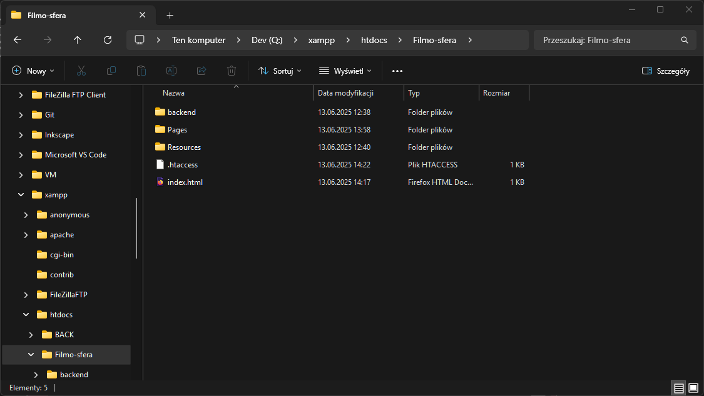
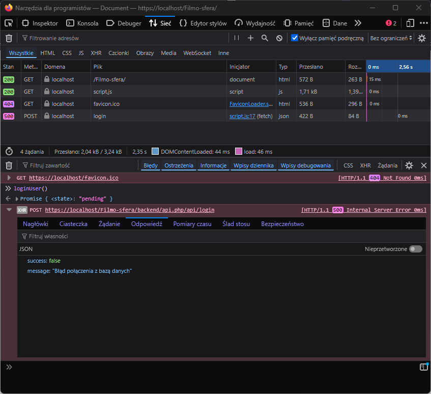

# Filmo-Sfera – projekt na wakacje :)

Musisz zainstalować:
- XAMPP [link](https://www.apachefriends.org/download.html)
- VS Code [link](https://code.visualstudio.com/Download)

Lokalizacja dla Twojego projektu to w przypadku Windowsa:  
`C:\xampp\htdocs\Filmo-sfera`

## Przygotowanie projektu

Pobierz repozytorium i rozpakuj jego zawartość do lokalizacji `C:\xampp\htdocs\Filmo-sfera`.  
Wynik końcowy powinien wyglądać tak (ja XAMPP-a mam zainstalowanego na partycji `Q:\`, ale Tobie zalecam partycję `C:\`):



Pierwsze uruchomienie to sprawdzenie, czy wysyłanie zapytań (requests) do backendu działa:



Gdy wywołałem przykładową funkcję `loginUser()`, w odpowiedzi z backendu uzyskałem response w formie JSON z informacją o problemie z połączeniem. To jest poprawne, bo nie utworzyłem jeszcze bazy danych – jedynie upewniłem się, że komunikacja działa.

> Pamiętaj, aby utworzyć bazę danych o nazwie `filmosfera` lub zmienić tę nazwę w pliku `api.php` w zmiennej `$db`.

## Podstawowa struktura aplikacji portalu do recenzowania filmów

Proszę działać na tej strukturze katalogowej projektu.

Twoim zadaniem będzie przygotowanie:
- Bazy danych (wszelkie zapytania do utworzenia tabel i insertu danych zapisuj w formie oddzielnych plików `.sql` – w razie awarii XAMPP-a łatwiej odbudujesz bazę danych),
- Poszczególnych szkieletów stron w katalogu `Pages` (szkieletowych, czyli sama struktura ze stylami – wszelkie dane powinny być dynamicznie uzupełniane przez `JavaScript`),
- Wystylizowania stron arkuszami `CSS`,
- Masz napisany kod PHP do obsługi `api.php`. Musisz w `switchu` dodawać sobie potrzebne *endpointy* i w razie potrzeby naprawiać błędy.

## Podsumowanie

Resztę informacji zamieściłem w plikach projektu.

---

# Postscriptum (Do 27 czerwca – po tej dacie będę niedostępny na Librusie.)

Tu będę zamieszczał dokładne objaśnienia tego, co dla Was jest niejasne – po wcześniejszym napisaniu wiadomości do mnie na Librusie.  
Przykładowo:  
## Pytanie: Jak przesłać plik z obrazkiem filmu na serwer?  
Odpowiedź:

Musisz utworzyć nowy endpoint, np.: `'/api/upload'`

```php
// Sprawdzenie, czy żądanie jest typu PUT
if ($_SERVER['REQUEST_METHOD'] === 'PUT') {
    //Reszta kodu
    }
```

Potem musisz odczytać surowe dane z `php://input` i zdekodować JSON na tablicę asocjacyjną. Wtedy możesz sprawdzić, czy istnieją wartości `image` oraz `name`.  
Podczas przesyłania obrazu wysyłasz jego nazwę i binarny zapis obrazu, tzw. `blob:`.  
Teraz musisz zdekodować obraz z pomocą funkcji PHP: `base64_decode()`, np.:  
```php
$image = base64_decode($imageData);
```

A następnie zapisać go jako plik z użyciem funkcji `file_put_contents()`.  
Przykładowo może to wyglądać tak:
```php
file_put_contents("../Resources/Images/" . $_SESSION["token"] . $name, $image);
```

`file_put_contents()` przyjmuje dwa argumenty: lokalizację i zdekodowany obraz. W powyższym kodzie lokalizacja zaczyna się od `../`, ponieważ plik `api.php` jest w katalogu `backend`, więc używając tej frazy cofasz się w hierarchii katalogowej.  
Potem scalasz wartości zmiennych w jeden ciąg znaków przy użyciu kropki – odwołujesz się do tokenu zapisanego w zmiennej sesyjnej i nazwy z rozszerzeniem pliku.

W JavaScript musisz napisać kolejną funkcję do wysyłania obrazu – najlepiej z formularza HTML.  
Prymitywna forma HTML może wyglądać następująco:
```html
<form action="" method="post" id="imgForm">
    <input type="file" name="img" id="img" accept="image/*" required>
    submit: <input type="submit" value="Wyślij">
</form>
```

Postaraj się przeanalizować tę funkcję asynchroniczną, wyszukując w internecie frazy, których nie rozumiesz.  
A oto kod metody, która przyjmuje jako argument referencję do elementu `input` typu `file` z HTML:

```javascript
async function uploadImage(inputFile) {
    if (!inputFile.files || inputFile.files.length === 0) {
        alert("Proszę wybrać plik do przesłania.");
        return;
    }

    const file = inputFile.files[0];
    const reader = new FileReader();

    reader.onload = async function (e) {
        const base64Image = e.target.result.split(",")[1]; // usuń nagłówek data:
        const payload = {
            image: base64Image,
            name: file.name,
        };

        try {
            const response = await fetch("/Filmo-sfera/backend/api.php/api/upload", {
                method: "PUT",
                headers: { "Content-Type": "application/json" },
                body: JSON.stringify(payload),
            });

            if (response.ok) {
                const data = await response.json();
                if (data.success) {
                    alert("Plik został przesłany pomyślnie!");
                } else {
                    alert(data.message || "Nie udało się przesłać pliku.");
                }
            } else {
                alert("Błąd serwera podczas przesyłania pliku.");
            }
        } catch (error) {
            console.error("Błąd podczas przesyłania pliku:", error);
            alert("Wystąpił błąd podczas przesyłania pliku. Spróbuj ponownie później.");
        }
    };

    reader.readAsDataURL(file);
}
```

---
